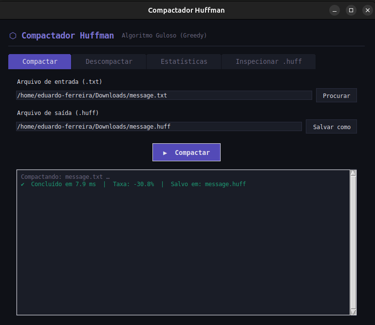
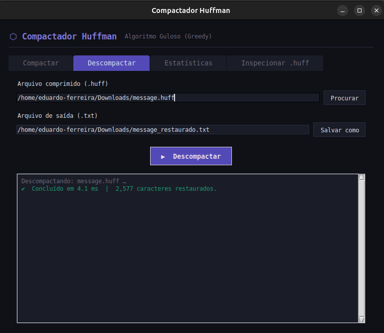
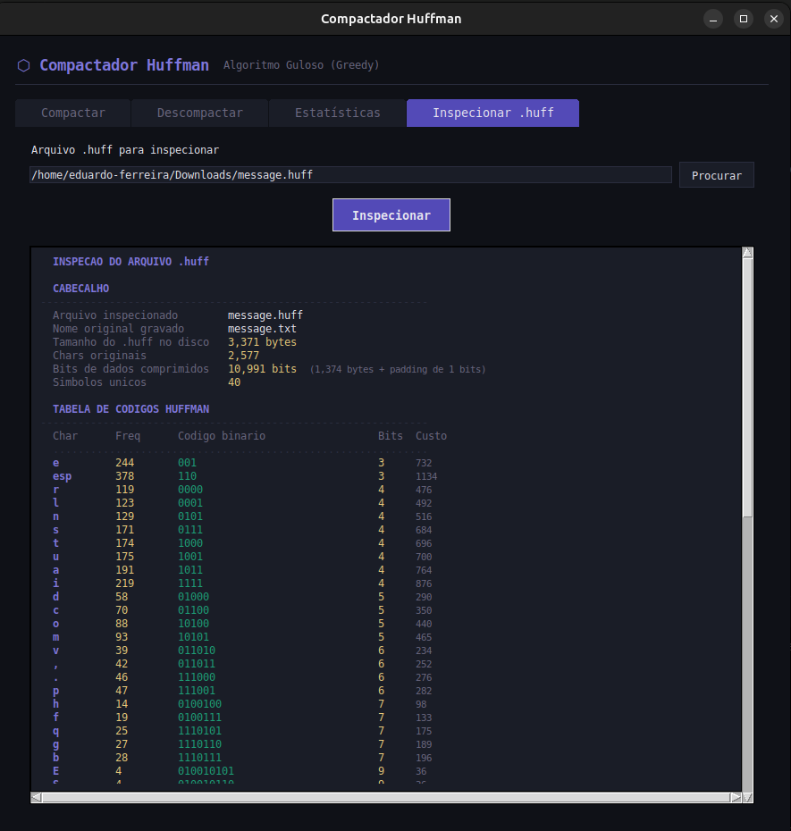
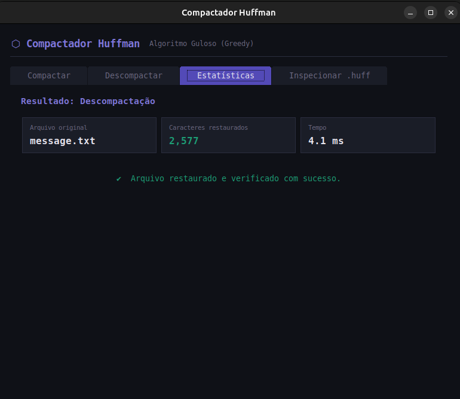

# G30_Greddy_PA-26.1

# Compactador-Huffman

Número da Lista: 30<br>
Conteúdo da Disciplina: Algoritmos Ambiciosos<br>

## Alunos
|Matrícula | Aluno |
| -- | -- |
| 20/0032364  |  Vitor Gabriel Gonçalves Dias |
| 22/1008632  |  Eduardo de Almeida Ferreira |

## Sobre 
Este projeto implementa um compactador e descompactador de arquivos de texto utilizando o Algoritmo de Huffman, um exemplo clássico de algoritmo guloso (greedy).
O algoritmo constrói uma árvore binária de codificação com base na frequência de cada caractere no texto. A cada passo, ele toma a decisão localmente ótima — unir os dois nós de menor frequência — o que garante uma solução globalmente ótima: a representação binária de menor custo total possível para aquela distribuição de caracteres.

Funcionalidades:

Compactar arquivos .txt gerando arquivos .huff.

Descompactar arquivos .huff restaurando o texto original com fidelidade total.

Exibir estatísticas detalhadas: taxa de compressão, entropia de Shannon, comprimento médio dos códigos e tabela completa de codificação.

Inspecionar o conteúdo interno de um arquivo .huff (árvore, bits, overhead)

## Screenshots





## Instalação 
Linguagem: Python 3.10+<br>
Framework: Tkinter<br>

1. **Clone o repositório**
   ```bash
    git clone https://github.com/projeto-de-algoritmos-2026/G30_Greddy_PA-26.1
    ```

2. **Acesse a pasta**
    ```bash
    cd Greed_Compactador-Huffman
    ```

3. **Execute o programa**
    ```bash
    python huffman_compactador.py
    ```

⚠️ Solução de Problemas (Tkinter)

Caso você encontre um erro informando que o módulo tkinter não foi encontrado, execute o comando abaixo de acordo com o seu sistema operacional:

No Linux (Debian/Ubuntu/Mint):
```bash
    sudo apt update
    sudo apt install python3-tk
```

No macOS (via Homebrew):
```bash
    brew install python-tk
```

No Windows:
O Tkinter geralmente já vem instalado com o Python. Caso não esteja, reinstale o Python através do instalador oficial do python.org, certificando-se de que a opção "tcl/tk and IDLE" esteja marcada.

## Uso 
Ao executar o programa, a interface gráfica abrirá com quatro abas:
1. Compactar

Clique em "Procurar" para selecionar um arquivo .txt
O nome do arquivo de saída .huff é sugerido automaticamente
Clique em "Compactar" para gerar o arquivo comprimido

2. Descompactar

Selecione um arquivo .huff gerado pelo programa
Escolha onde salvar o .txt restaurado
Clique em "Descompactar" — o arquivo original é recuperado com fidelidade total

3. Estatísticas

Exibida automaticamente após qualquer operação
Mostra: tamanho original vs comprimido, taxa de compressão, tempo, entropia de Shannon, comprimento médio dos códigos Huffman e tabela completa de caracteres com seus códigos binários

4. Inspecionar .huff

Selecione qualquer arquivo .huff e clique em "Inspecionar"
Revela o conteúdo interno: cabeçalho, tabela de códigos, visualização binária dos bytes e taxa de compressão real (considerando o overhead da árvore serializada)

## Vídeo - Apresentação
[](https://www.youtube.com/watch?v=UQluK6qv6BM)


## Outros 
Por que o arquivo pode crescer em vez de encolher?
O Huffman tem um custo fixo: a árvore de codificação precisa ser gravada dentro do .huff para que a descompactação seja possível. Em arquivos muito pequenos (geralmente abaixo de ~500 caracteres), esse overhead pode superar o ganho da compressão, fazendo o arquivo resultante ser maior que o original. Esse comportamento é esperado e está documentado na aba de Estatísticas.
